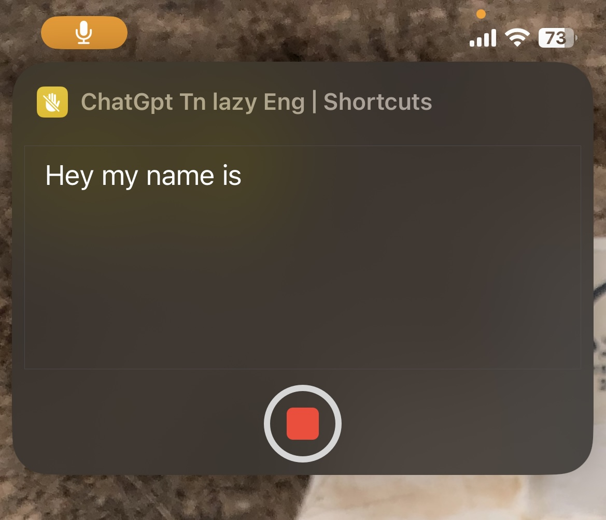

<h1 align="center">Hi 👋, I'm Hakim ben hadj brahim</h1>

<h3 align="left">Connect with me:</h3>

# ChatGPT TN English

## Features

I created a custom shortcut for iPhone, Macbook and Apple Watch that uses OpenAI's ChatGPT technology to make it easy to use without requiring a login. The voice command support for English is robust enough to accept text input and respond with responses of more than 500 words depending on the latest updates from OpenAI's ChatGPT API. The functionality provided by this shortcut was developed by Hakim Ben Hadj Brahim.
## Update
v2
This upgrade fix for a bug related to saving and exiting ,takes text results from 550 words up to 700 words, making it an even more powerful tool for anyone who wants quick and easy access to bilingual communication and text processing capabilities. 
## 🚀 About Me
My name is Hakim ben hadj brahim  I am a student in Issat Mateur and I would like to share my project with others who could benefit from it. This project is designed to provide a much-needed service in life, and I am confident it can make a lasting impact.
 
## 🔗 Links

# Screenshots []
  
  
  
## Authors

- [@Hakimbhb](https://www.github.com/hakimbhb)

## Link to Download

https://routinehub.co/shortcut/13998/
